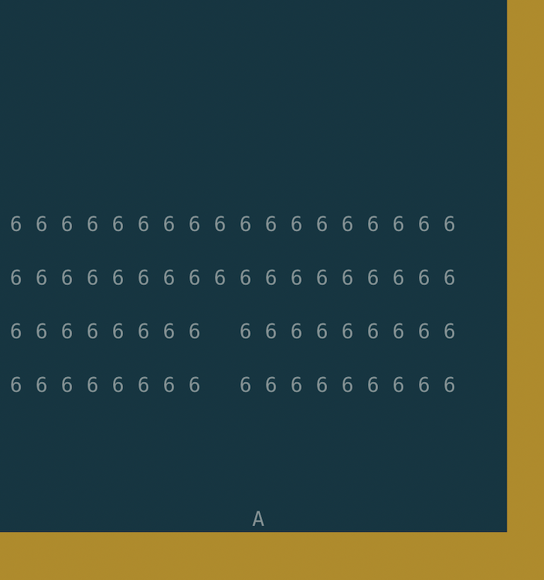

## One Too Many

### Overview
Something I tried to understand gaming and terminal interaction using Rust.

### Usage
1. Install Rust
2. Clone an `cd` into this repo
3. Enter `cargo run`

### It should look like this

### Future Work
1. Menu
2. High score record
3. Levels

##### Inspiration
 some udemy course on rust (: